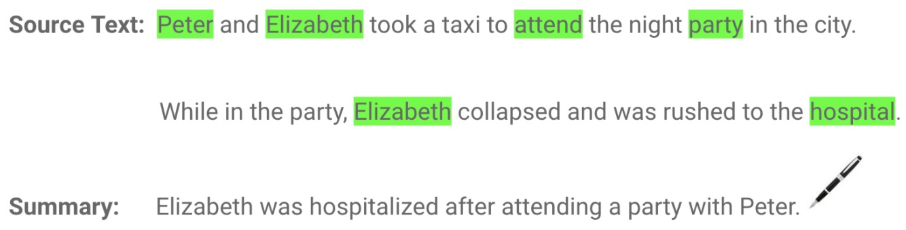

## **文本摘要类型 **

文本摘要一般可分为提取（extraction）和抽象（abstraction）两种。

### 基于提取的摘要（extractive-based summarization）

把文章中最重要的词提取出来，直接组合形成摘要，相当于利用荧光笔划重点。

机器学习中首先对句子中的关键部分进行权重打分，进而利用权重进行摘要生成。不同的算法计算权重的方法也不一样。根据算法得到每个词的权重，进一步把权重最高的几个词直接拼凑起来，形成摘要。这样生成的摘要在语法上不一定正确。

<div align="center">

</div>

### 基于抽象的摘要（abstraction-based summarization）

利用深度学习技术，“理解”并重写句子形成摘要，可以解决提取方法的语法错误问题，生成新的短语和句子。生成的摘要可能不是原来文档的一部分。

<div align="center">

</div>

抽象式方法需要一系列复杂的深度学习算法和语言模型以达到良好的性能，例如自然语言生成、语义表示和推理。

## 实现基于提取的文本摘要步骤

文本内容：

```
“Peter and Elizabeth took a taxi to attend the night party in the city. While in the party, Elizabeth collapsed and was rushed to the hospital. Since she was diagnosed with a brain injury, the doctor told Peter to stay besides her until she gets well. Therefore, Peter stayed with her at the hospital for 3 days without leaving.”
```

为了保证句子语法的正确性，可以在对词汇进行权重计算的基础上，再对句子中的词汇的权重进行求和，得出句子权重。具体步骤如下：

**Step 1: 将段落转换成句子**

以句号为标示，分割句子：

```
1. Peter and Elizabeth took a taxi to attend the night party in the city
2. While in the party, Elizabeth collapsed and was rushed to the hospital
3. Since she was diagnosed with a brain injury, the doctor told Peter to stay besides her until she gets well
4. Therefore, Peter stayed with her at the hospital for 3 days without leaving
```

**Step 2: 文本化处理**

去除停词、数字、标点和其他特殊字符，过滤多余和无关紧要的信息。

```
1. Peter Elizabeth took taxi attend night party city
2. Party Elizabeth collapse rush hospital
3. Diagnose brain injury doctor told Peter stay besides get well
4. Peter stay hospital days without leaving
```

**Step 3: Tokenization**

获取词表

```
['peter','elizabeth','took','taxi','attend','night','party','city','party','elizabeth','collapse','rush','hospital', 'diagnose','brain', 'injury', 'doctor','told','peter','stay','besides','get','well','peter', 'stayed','hospital','days','without','leaving']
```

**Step 4: 计算词汇的权重得分**

首先计算词在句子中出现的次数，然后转化为加权频率，出现最多词汇的权重为1，其他词汇按频次比例计算。

| WORD      | FREQUENCY | WEIGHTED FREQUENCY |
| :-------- | :-------- | :----------------- |
| peter     | 3         | 1                  |
| elizabeth | 2         | 0.67               |
| took      | 1         | 0.33               |
| taxi      | 1         | 0.33               |
| attend    | 1         | 0.33               |
| night     | 1         | 0.33               |
| party     | 2         | 0.67               |
| city      | 1         | 0.33               |
| collapse  | 1         | 0.33               |
| rush      | 1         | 0.33               |
| hospital  | 2         | 0.67               |
| diagnose  | 1         | 0.33               |
| brain     | 1         | 0.33               |
| injury    | 1         | 0.33               |
| doctor    | 1         | 0.33               |
| told      | 1         | 0.33               |
| stay      | 2         | 0.67               |
| besides   | 1         | 0.33               |
| get       | 1         | 0.33               |
| well      | 1         | 0.33               |
| days      | 1         | 0.33               |
| without   | 1         | 0.33               |
| leaving   | 1         | 0.33               |

**Step 5:  计算句子的权重得分**

对每个句子中的单词进行加权频值的累加，得到句子权重得分：

| SENTENCE | ADD WEIGHTED FREQUENCIES                                     | 对词汇权重求和                                               | 句子得分 |
| :------- | :----------------------------------------------------------- | :----------------------------------------------------------- | :------- |
| 1        | Peter and Elizabeth took a taxi to attend the night party in the city | 1 + 0.67 + 0.33 + 0.33 + 0.33 + 0.33 + 0.67 + 0.33           | 3.99     |
| 2        | While in the party, Elizabeth collapsed and was rushed to the hospital | 0.67 + 0.67 + 0.33 + 0.33 + 0.67                             | 2.67     |
| 3        | Since she was diagnosed with a brain injury, the doctor told Peter to stay besides her until she gets well. | 0.33 + 0.33 + 0.33 + 0.33 + 1 + 0.33 + 0.33 + 0.33 + 0.33 +0.33 | 3.97     |
| 4        | Therefore, Peter stayed with her at the hospital for 3 days without leaving | 1 + 0.67 + 0.67 + 0.33 + 0.33 + 0.33                         | 3.33     |

根据句子权重得分，可以看出第一句子在文本中权值最大，可以认为是最具代表性的句子，可以认为是文本的摘要，也可以取前k个最高得分句子作为摘要。

## 维基百科文章的文字摘要

下面利用上述方法，对维基百科网页中的内容进行摘要抽取，需要用到urllib和[Beautiful Soup](https://www.crummy.com/software/BeautifulSoup/)两个工具包获取文章内容，用[NLTK](https://www.nltk.org/)进行统计分析。

首先从网页抓取文章内容：

```python
import bs4 as BeautifulSoup
import urllib.request  

# Fetching the content from the URL
fetched_data = urllib.request.urlopen('https://en.wikipedia.org/wiki/20th_century')

article_read = fetched_data.read()

# Parsing the URL content and storing in a variable
article_parsed = BeautifulSoup.BeautifulSoup(article_read,'html.parser')

# Returning <p> tags
paragraphs = article_parsed.find_all('p')

article_content = ''

# Looping through the paragraphs and adding them to the variable
for p in paragraphs:  
    article_content += p.text
```