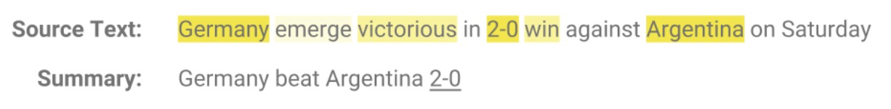

CONTENT：

- 文本摘要类型
- 基于提取的文本摘要步骤
- **基于提取的文本摘要实现**
- 进一步讨论

## 文本摘要类型 

文本摘要一般可分为提取（extraction）和抽象（abstraction）两种。

### 基于提取的摘要（extractive-based summarization）

把文章中最重要的词提取出来，直接组合形成摘要，相当于利用荧光笔划重点。

<div align="center">

</div>

机器学习中首先对句子中的关键部分进行权重打分，进而利用权重进行摘要生成。不同的算法计算权重的方法也不一样。根据算法得到每个词的权重，进一步把权重最高的几个词直接拼凑起来，形成摘要。这样生成的摘要在语法上不一定正确。

### 基于抽象的摘要（abstraction-based summarization）

利用深度学习技术，“理解”并重写句子形成摘要，可以解决提取方法的语法错误问题，生成新的短语和句子。生成的摘要可能不是原来文档的一部分。

<div align="center">

</div>

抽象式方法需要一系列复杂的深度学习算法和语言模型以达到良好的性能，例如自然语言生成、语义表示和推理。

## 实现基于提取的文本摘要步骤

文本内容：

```
“Peter and Elizabeth took a taxi to attend the night party in the city. While in the party, Elizabeth collapsed and was rushed to the hospital. Since she was diagnosed with a brain injury, the doctor told Peter to stay besides her until she gets well. Therefore, Peter stayed with her at the hospital for 3 days without leaving.”
```

为了保证句子语法的正确性，可以在对词汇进行权重计算的基础上，再对句子中的词汇的权重进行求和，得出句子权重。具体步骤如下：

**Step 1: 将段落转换成句子**

以句号为标示，分割句子：

```
1. Peter and Elizabeth took a taxi to attend the night party in the city
2. While in the party, Elizabeth collapsed and was rushed to the hospital
3. Since she was diagnosed with a brain injury, the doctor told Peter to stay besides her until she gets well
4. Therefore, Peter stayed with her at the hospital for 3 days without leaving
```

**Step 2: 文本化处理**

去除停词、数字、标点和其他特殊字符，过滤多余和无关紧要的信息。

```
1. Peter Elizabeth took taxi attend night party city
2. Party Elizabeth collapse rush hospital
3. Diagnose brain injury doctor told Peter stay besides get well
4. Peter stay hospital days without leaving
```

**Step 3: Tokenization**

获取词表

```
['peter','elizabeth','took','taxi','attend','night','party','city','party','elizabeth','collapse','rush','hospital', 'diagnose','brain', 'injury', 'doctor','told','peter','stay','besides','get','well','peter', 'stayed','hospital','days','without','leaving']
```

**Step 4: 计算词汇的权重得分**

首先计算词在句子中出现的次数，然后标准化为加权频率，出现最多词汇的权重为1，其他词汇按频次比例计算。

| WORD      | FREQUENCY | WEIGHTED FREQUENCY |
| :-------- | :-------- | :----------------- |
| peter     | 3         | 1                  |
| elizabeth | 2         | 0.67               |
| took      | 1         | 0.33               |
| taxi      | 1         | 0.33               |
| attend    | 1         | 0.33               |
| night     | 1         | 0.33               |
| party     | 2         | 0.67               |
| city      | 1         | 0.33               |
| collapse  | 1         | 0.33               |
| rush      | 1         | 0.33               |
| hospital  | 2         | 0.67               |
| diagnose  | 1         | 0.33               |
| brain     | 1         | 0.33               |
| injury    | 1         | 0.33               |
| doctor    | 1         | 0.33               |
| told      | 1         | 0.33               |
| stay      | 2         | 0.67               |
| besides   | 1         | 0.33               |
| get       | 1         | 0.33               |
| well      | 1         | 0.33               |
| days      | 1         | 0.33               |
| without   | 1         | 0.33               |
| leaving   | 1         | 0.33               |

**Step 5:  计算句子的权重得分**

对每个句子中的单词进行加权频值的累加，得到句子权重得分：

| SENTENCE | 句子                                                         | 对词汇权重求和                                               | 句子得分 |
| :------- | :----------------------------------------------------------- | :----------------------------------------------------------- | :------- |
| 1        | Peter and Elizabeth took a taxi to attend the night party in the city | 1 + 0.67 + 0.33 + 0.33 + 0.33 + 0.33 + 0.67 + 0.33           | 3.99     |
| 2        | While in the party, Elizabeth collapsed and was rushed to the hospital | 0.67 + 0.67 + 0.33 + 0.33 + 0.67                             | 2.67     |
| 3        | Since she was diagnosed with a brain injury, the doctor told Peter to stay besides her until she gets well. | 0.33 + 0.33 + 0.33 + 0.33 + 1 + 0.33 + 0.33 + 0.33 + 0.33 +0.33 | 3.97     |
| 4        | Therefore, Peter stayed with her at the hospital for 3 days without leaving | 1 + 0.67 + 0.67 + 0.33 + 0.33 + 0.33                         | 3.33     |

根据句子权重得分，可以看出第一句子在文本中权值最大，可以认为是最具代表性的句子，可以认为是文本的摘要，也可以取前k个最高得分句子作为摘要。

## 维基百科文章的文字摘要

下面利用上述方法，对某个维基百科网页中的内容进行摘要抽取，需要用到urllib和[Beautiful Soup](https://www.crummy.com/software/BeautifulSoup/)两个工具包获取文章内容，用[NLTK](https://www.nltk.org/)进行统计分析。

根据上面的步骤，代码可以这样构建：

```
# 1、建立词频表
frequency_table = _create_dictionary_table(article)
# 2、句子Tokenizing 
sentences = sent_tokenize(article)
# 3、计算句子得分
sentence_scores = _calculate_sentence_scores(sentences, frequency_table)
# 4、计算截断阈值（得分高过阈值的句子认为是摘要）
threshold = _calculate_average_score(sentence_scores)
# 5、抽取摘要
article_summary = _get_article_summary(sentences, sentence_scores, 1.5 * threshold)

print(article_summary)
```

### 具体实现

#### **Step 0 准备数据**

用urllib链接到目标网页，BeautifulSoup用于处理网页内容，得到转化后的文本article_content。

```python
import bs4 as BeautifulSoup
import urllib.request  

# Fetching the content from the URL
fetched_data = urllib.request.urlopen('https://en.wikipedia.org/wiki/20th_century')

article_read = fetched_data.read()

# Parsing the URL content and storing in a variable
article_parsed = BeautifulSoup.BeautifulSoup(article_read,'html.parser')

# Returning <p> tags
paragraphs = article_parsed.find_all('p')

article_content = ''

# Looping through the paragraphs and adding them to the variable
for p in paragraphs:  
    article_content += p.text
```

#### **Step 1 计算词频表**

这里用到的这个PorterStemmer工具实际上比较粗糙，例如was->wa，nltk中还有其他词还原的方法SnowballStemmer，LancasterStemmer等。另外这里省略了对词频进行标准化。

```python
from nltk.corpus import stopwords
from nltk.stem import PorterStemmer 
from nltk.tokenize import word_tokenize, sent_tokenize

def _create_dictionary_table(text_string) -> dict:
    # nltk停用词
    stop_words = set(stopwords.words("english"))    
    # nltk把单词还原成词根形式的方法
    stem = PorterStemmer()
    # tokenize
    words = word_tokenize(text_string)
    frequency_table = dict()
    for wd in words:
        wd = stem.stem(wd)
        if wd not in stop_words:
            if wd in frequency_table:
                frequency_table[wd] += 1
            else:
                frequency_table[wd] = 1
    return frequency_table
```

#### **Step 2 文章拆分为句子**

```python
def _sent_tokenize(article):
    sentences = sent_tokenize(article)
    return sentences
```

#### **Step 3 计算句子加权频率**

这里也用stem把句子进行词还原，nltk中的这个工具对有些词效果不太好，不过对整体影响不大，也可以用。

```python
def _calculate_sentence_scores(sentences, frequency_table) -> dict:
    sentence_weight = dict()
    stem = PorterStemmer()
    for sentence in sentences:
        sentence_stem = ' '.join([stem.stem(wd) for wd in sentence.split()]) 
        sentence_wordcount_without_stop_words = 0
        for word_weight in frequency_table:
            if word_weight in sentence_stem.lower():
                sentence_wordcount_without_stop_words += 1
                # 句子前7个词作为dict句子索引
                if sentence[:7] in sentence_weight:
                    sentence_weight[sentence[:7]] += frequency_table[word_weight]
                else:
                    sentence_weight[sentence[:7]] = frequency_table[word_weight]
            # 标准化句子得分
        sentence_weight[sentence[:7]] = sentence_weight[sentence[:7]]/sentence_wordcount_without_stop_words
    return sentence_weight
```

#### **Step 4 计算句子平均得分**

句子平均得分作为判断句子可否作为摘要的阈值

```python
def _calculate_average_score(sentence_weight) -> int:
    sum_values = 0
    for entry in sentence_weight:
        sum_values += sentence_weight[entry]
    average_score = (sum_values / len(sentence_weight)) 
    return average_score
```

#### **Step 5 抽取摘要**

把大于阈值的句子合并起来作为摘要

```python
def _get_article_summary(sentences, sentence_weight, threshold):
    sentence_counter = 0
    article_summary = ''
    for sentence in sentences:
        if sentence[:7] in sentence_weight and sentence_weight[sentence[:7]] >= (threshold):
            article_summary += " " + sentence
            sentence_counter += 1
    return article_summary, sentence_counter
```

#### main

执行上面的函数，这里的1.5是一个**超参数**，可以根据最后摘要的效果进行调整。

```python
# step 1-5
frequency_table = _create_dictionary_table(article)
sentences = _sent_tokenize(article)
sentence_scores = _calculate_sentence_scores(sentences, frequency_table)
threshold = _calculate_average_score(sentence_scores)
article_summary, sentence_counter = _get_article_summary(sentences, sentence_scores, 1.5 * threshold)
```

得到的摘要为：

```python
print("摘要：\n",article_summary)
```

```
摘要：
  Humans explored space for the first time, taking their first footsteps on the Moon. However, these same wars resulted in the destruction of the imperial system. The victorious Bolsheviks then established the Soviet Union, the world's first communist state. At the beginning of the period, the British Empire was the world's most powerful nation,[15] having acted as the world's policeman for the past century. In total, World War II left some 60 million people dead. At the beginning of the century, strong discrimination based on race and sex was significant in general society. During the century, the social taboo of sexism fell. Since the US was in a dominant position, a major part of the process was Americanization. Terrorism, dictatorship, and the spread of nuclear weapons were pressing global issues. Millions were infected with HIV, the virus which causes AIDS. This includes deaths caused by wars, genocide, politicide and mass murders. Later in the 20th century, the development of computers led to the establishment of a theory of computation.
```

## 更进行一步的方法

以上只是实现了抽取是的文本摘要，抽象文本摘要更加符合现实情况人们对文本理解总结的摘要。进一步的学习：

* 结合抽取和抽象两种方法的[指针生成网络](https://arxiv.org/pdf/1704.04368.pdf )

  <div align="center">
  
  </div>

* 使用大规模数据集[WikiHow](https://arxiv.org/pdf/1810.09305.pdf)，这是一个包含23万多篇文章的大规模数据集。
* 使用[seq2seq框架进行文本摘要](https://arxiv.org/pdf/1902.09243.pdf)，编码器和解码器都使用了[BERT](https://arxiv.org/abs/1810.04805)，seq2seq框架取得了优于传统的表现。

参考： [A Gentle Introduction to Text Summarization in Machine Learning](https://blog.floydhub.com/gentle-introduction-to-text-summarization-in-machine-learning/)