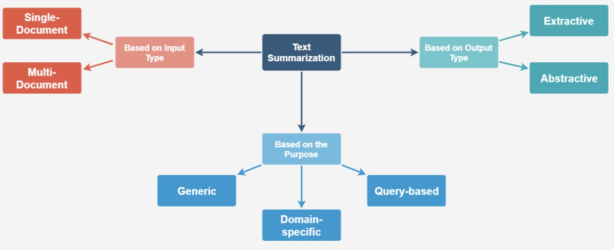
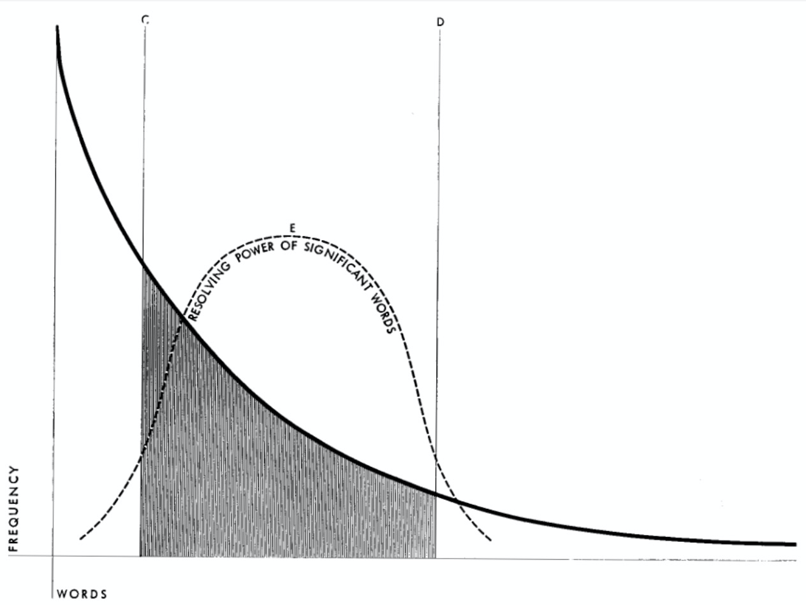
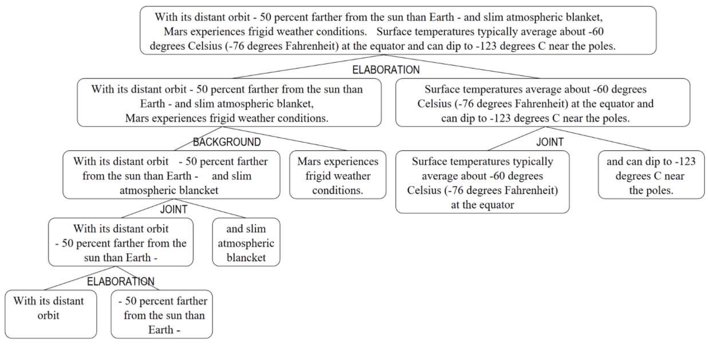
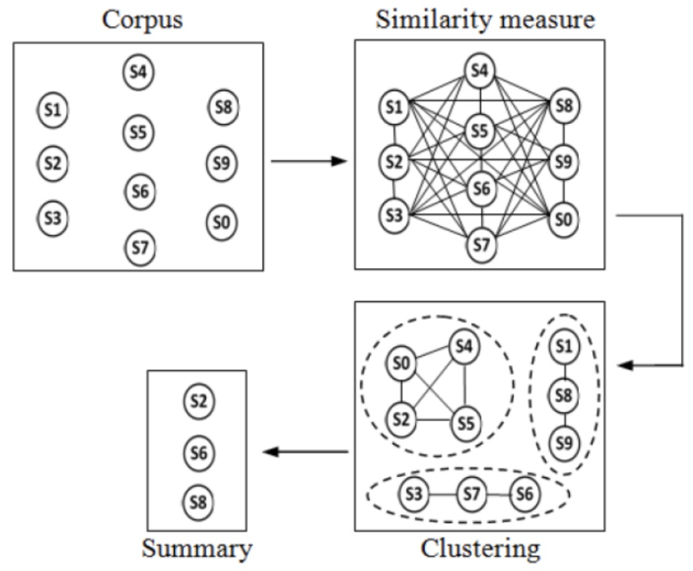
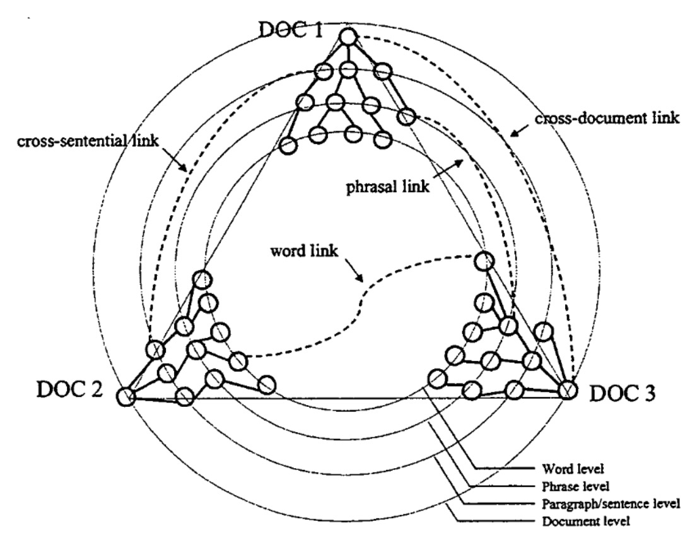
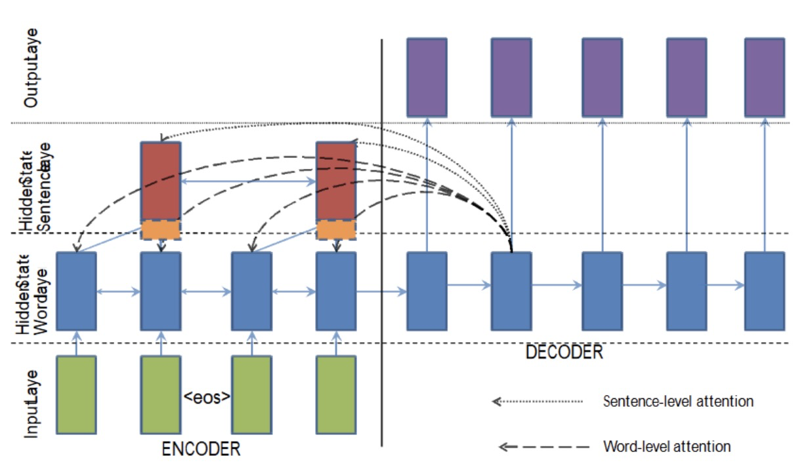
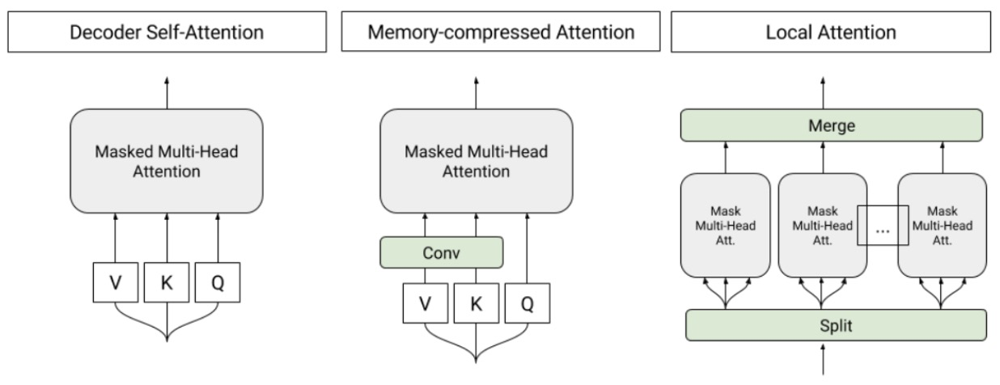
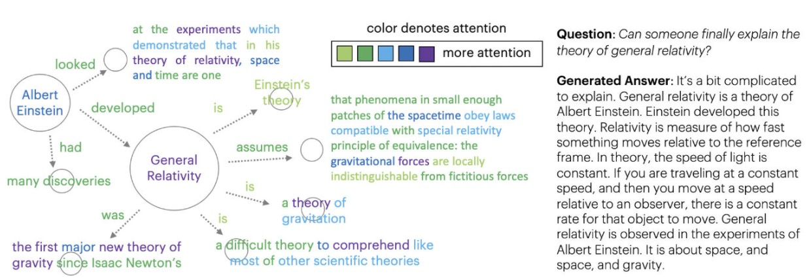
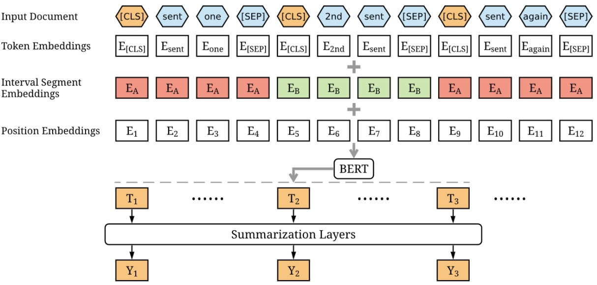

CONTENT：

* 梳理文本摘要的历史
* 讨论现阶段文本摘要常见问题
* *ps：适合在参考文献中淘宝*

### 梳理文本摘要的历史

1958

Luhn[1]利用单词频率确定句子重要性，属于抽取型（extractive）方法。通过设置阈值去掉高频和低频词，但该工作没有合并同一单词的不同形式。

1969

Edmundson[2]除了使用词频外还使用实词和提示词，标题和标题词，结构指示信息如句子的位置，来提高抽取效果。提示词为'significant', 'impossible' and 'hardly'，分别代表显著相关、可能相关、不相关。假设最重要的句子或段落出现在文始或文末。指出未来的算法除了统计信息外，应当把句法和语义考虑在内。

1995

Kupiec[3]使用基于朴素贝叶斯的有监督机器学习算法，在手工抽取的数据上训练。特征包括了句子长度，固定短语，段落，主题词和大写词。忽略短句子，选出主题词，专有名称和首字母缩写词。类似 'conclusions', 'summary' or 'discussion'的词更容易出现在摘要中。

1997

Marcu[4]在博士论文中受修辞理论结构（Rhetorical Structure Theory，RST）启发，研究两个不重叠的文本之间（nucleus and satellite）的修辞关系。把文本分解为修辞关系链接的小单元。关系包括 justification, evidence, restatement, concession等。如图所示，*Justification*是Mars weather 和 distant orbit的关系[5]。

2000

Radev[6]提出基于中心的多文本摘要，对相似的文档和句子进行聚类，每个类别表示一个不同的子话题。类中心是代表类的伪文档，摘要将包含类似于中心的句子。Kumar[7]在2016年提出了类似的方法。

2000

之前的RST是针对单个文档的，Radev[6]提出了跨文档结构理论（Cross-document Structure Theory ，CST），旨在解决多文档摘要问题。提出了多文档图来在word, phrase, paragraph , document这些不同level中表示关系。共提出了24中关系，例如类似、包含、跟进等。摘要包括四个步骤：聚类，文档结构分析，链接分析和基于图的个性化摘要。

2004

Barzilay[8]提出了领域敏感的内容模型，基于HMM，领域主题是状态，生成该主题相关的句子。状态转换对应主题更改，n-gram模型用于生成句子，模型同时学习内容选择和信息排序，[5]也做了相同的工作。

2004 

受Google的PageRank算法的启发，Mihalcea提出TextRank，这是一种基于图的算法，每个句子是一个图中的结点，边和句子相似性有关，如cosine similarity[7]。排序算法（HITS, POS,  PageRank等）在graph上跑。得分最高的一些结点选出来做摘要[9]。

2006

Wu[10]提出了基于事件的摘要，事件项可以是动词短语或者动名词短语，事件元素为实体（人、组织、位置、时间）。文档表示为事件图，该事件图上采用PageRank算法。Li[11]的工作也是基于事件的，更关注事件内和事件间的相关性。

2015

Rush[12]等人用神经网络进行抽象摘要，之前的抽摘要方法依赖于语言约束或句法转换，提出的方法将神经语言模型和基于注意力机制的输入编码器一起使用。实验的三种编码器：词袋，卷积（TDNN）和基于注意力的编码器。使用基于注意力的编码器的模型表现最佳。该工作仅仅是一句话的标题生成，在2016年被改进[13]。

2016

Nallapati[14]等人也会难过基于attention的encoder-decoder RNN进行抽象摘要。输入embedding是feature-rich的，包括了词，POS，NER，TF和IDF。指针生成器模型用于处理OOV问题。注意力机制在词和句子级别是分层的。提出了CNN /DailyMail多文本数据集，摘要中的平均数为53个单词和3.72个句子，这为长文本抽象摘要建立了baseline[15]。

2018

Liu[16]等人尝试多文档摘要，尝试生成**Wikipedia**文章。提取阶段使用最重要的tokens；抽象摘要生成阶段，使用可扩展的仅解码器的transformer，输入和输出序列合并进了一个sequence。为了扩展到长序列，提出了memory-compressed attention。

2019

Fan[17]等人用知识图表示作为输入，再序列化，送入seq2seq模型，涉及到合并节点和解析共指。

2019

Liu[18]等人提出*BERTSUM*，把多个句子编码作为单个输入序列，为了fine-tuning和捕获document-level的特征，尝试了不同的摘要层：简单分类器、RNN, inter-sentence transformer等，最后发现两层inter-sentence transformer效果最好。

### 参考：

[本文主要基于这篇不错的文本摘要调研博客 ](https://devopedia.org/text-summarization#Liu-2019)

[[1]Luhn, H. P. 1958. "The automatic creation of literature abstracts." IBM Journal of Research and Development](http://courses.ischool.berkeley.edu/i256/f06/papers/luhn58.pdf)

[[2]Edmundson, H. P. 1969. "New Methods in Automatic Extracting." ACM](http://courses.ischool.berkeley.edu/i256/f06/papers/edmonson69.pdf)

[[3]Kupiec, Julian, Jan Pedersen, and Francine Chen. 1995. "A trainable document summarizer." ACM SIGIR ](http://citeseerx.ist.psu.edu/viewdoc/download?doi=10.1.1.452.7100&rep=rep1&type=pdf)

[[4]Marcu, Daniel. 1997. "The Rhetorical Parsing, Summarization, and Generation of Natural Language Texts." ](https://www.cs.toronto.edu/pub/gh/Marcu-PhDthesis.pdf)

[[5]Jurafsky, Daniel, and James H. Martin. 2009. "Question Answering and Summarization." ](https://github.com/rain1024/slp2-pdf/blob/master/chapter-wise-pdf/[23] Question Answering and Summarization.pdf)

[[6]Radev, Dragomir. 2000. "A Common Theory of Information Fusion from Multiple Text Sources Step One: Cross-Document Structure."  ACL](https://www.aclweb.org/anthology/W00-1009/)

[[7]Kumar, 2016. "A Review on Automatic Text Summarization Approaches."JCSSP ](https://thescipub.com/PDF/jcssp.2016.178.190.pdf)

[[8]Barzilay. 2004. "Catching the Drift: Probabilistic Content Models, with Applications to Generation and Summarization." NAACL ](https://www.aclweb.org/anthology/N04-1015/)

[[9]Mihalcea, 2004. "Graph-based Ranking Algorithms for Sentence Extraction, Applied to Text Summarization."  ACL ](https://www.aclweb.org/anthology/P04-3020/)

[[10]Wu, 2006. "Investigations on Event-Based Summarization." COLING/ACL ](https://www.aclweb.org/anthology/P06-3007/)

[[11]Li, 2006. "Extractive Summarization using Inter- and Intra- Event Relevance." ACL](https://www.aclweb.org/anthology/P06-1047/)

[[12]Rush, 2015. "A Neural Attention Model for Abstractive Sentence Summarization." NLP](https://www.aclweb.org/anthology/D15-1044/)

[[13]See.  2017. "Get To The Point: Summarization with Pointer-Generator Networks."](https://arxiv.org/abs/1704.04368)

[[14]Nallapati 2016. "Abstractive Text Summarization using Sequence-to-sequence RNNs and Beyond." ACL](https://www.aclweb.org/anthology/K16-1028/)

[[15]See. 2017. "Get To The Point: Summarization with Pointer-Generator Networks." arXiv](https://arxiv.org/abs/1704.04368)

[[16]Liu, 2018. "Generating Wikipedia by Summarizing Long Sequences." ](https://arxiv.org/abs/1801.10198)

[[17]Fan,  2019. "Using Local Knowledge Graph Construction to Scale Seq2Seq Models to Multi-Document Inputs."](https://arxiv.org/abs/1910.08435)

[[18]Liu, Yang. 2019. "Fine-tune BERT for Extractive Summarization."](https://arxiv.org/abs/1903.10318)